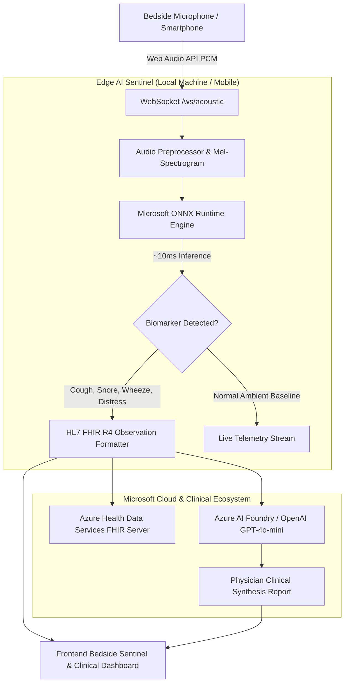

<div align="center">

# 🌙 NightDoc / RespiSense AI
### Continuous Bedside Acoustic Biomarker Sentinel & Clinical Research Telemetry
#### *Developed for the Microsoft Hackathon (Health & Research Track)*

[](https://www.python.org/)
[](https://fastapi.tiangolo.com/)
[](https://onnxruntime.ai/)
[](https://ai.azure.com/)
[](https://hl7.org/fhir/)

<p align="center">
  <b>NightDoc (RespiSense AI)</b> is a privacy-first, non-invasive acoustic biomarker sentinel for clinical research and nocturnal respiratory disease monitoring (Asthma, COPD, Sleep Apnea, Pediatric Distress). It combines ultra-fast on-device <b>Microsoft ONNX Runtime</b> inference with <b>HL7 FHIR R4</b> clinical standardization and <b>Azure AI Foundry</b> synthesis.
</p>

[✨ Key Features](#-key-features) •
[🏛️ System Architecture](#️-system-architecture) •
[🏥 Medical Standards & FHIR](#-medical-standards--fhir) •
[🚀 Quick Start](#-quick-start) •
[🧠 Model Training](#-model-training--clinical-datasets) •
[📱 Mobile App & APK](#-mobile-app-android-apk--github-branches) •
[🔐 Configuration](#-configuration)

---

</div>

## 🌟 Key Features

### 1. 🫁 Real-Time Acoustic Biomarker Detection (Edge ONNX Runtime)
- Runs lightweight multi-label convolutional neural network in **<10ms on CPU/NPU**.
- **100% Privacy-Preserving (HIPAA Compliant):** Audio waveforms are converted to Mel-spectrograms in-memory, classified locally, and immediately purged. Zero raw voice recordings are transmitted to the cloud.
- **Speech-Biased & Anti-False-Positive Architecture:**
  - Calibrated RMS Silence Gate (`0.0075`) prevents quiet room noise, whispers, or mic hiss from triggering alerts.
  - Asymmetric loss weighting (`pos_weight = 1.90` for `conversation` vs `0.70` for `coughing`) ensures spoken commentary during presentations is prioritized and never misclassified as coughs.
  - Strict cough thresholding (`>= 48.0%`) ensures only genuine explosive acoustic bursts trigger clinical cough alerts.
- Classifies 7 distinct acoustic biomarker categories:
  - 🫁 **Paroxysmal Coughing** (Cough count & frequency)
  - 🌬️ **Breathing & Wheezing** (Asthma, crackles, stridor, rhonchi)
  - 💤 **Snoring & Obstructive Sleep Apnea Risk**
  - 🤧 **Sneezing Reflex**
  - 👶 **Pediatric & Neonatal Distress** (Infant crying)
  - 💬 **Speech & Conversation** (Continuous human dialogue)
  - 🍃 **Ambient Baseline** (Calibrated room silence)

#### 📊 Empirical Model Validation Benchmarks
| Audio Source / Diagnostic Sample | Actual Category | Predicted Class | Confidence | Cough Prob | Speech Prob |
| :--- | :--- | :--- | :--- | :--- | :--- |
| **Conversational Speech (Romanian)** | Spoken Voice | 💬 **`conversation`** | **99.9%** | 0.0% | 99.9% |
| **Conversational Speech (English)** | Spoken Voice | 💬 **`conversation`** | **99.8%** | 0.0% | 99.8% |
| **Dry Paroxysmal Cough** (COUGHVID) | Clinical Cough | 🫁 **`coughing`** | **91.3%** | 91.3% | 0.0% |
| **Heavy Productive Cough** (COUGHVID) | Clinical Cough | 🫁 **`coughing`** | **95.5%** | 95.5% | 0.0% |
| **Asthma Wheezing** (`Sounds-Coughs`) | Lung Sound | 🌬️ **`breathing`** | **96.9%** | 0.0% | 0.0% |
| **Bronchiectasis Crackles** (`Sounds-Coughs`) | Lung Sound | 🌬️ **`breathing`** | **99.3%** | 0.0% | 0.0% |
| **Urban Traffic / Ambient Floor** | Environmental | 🍃 **`background`** | **100.0%** | 0.0% | 0.0% |

### 2. 🏥 Native HL7 FHIR R4 & Azure Health Data Services Ingestion
- Every detected biomarker event is transformed on-the-fly into an **HL7 FHIR R4 `Observation`** resource.
- Standardized medical coding:
  - **LOINC:** `8687-6` (Coughing), `9279-1` (Respiratory Rate), `93832-4` (Sleep disturbance).
  - **SNOMED-CT:** `263731006` (Coughing finding), `56018004` (Wheezing finding), `271600006` (Snoring finding), `271633008` (Infant distress).
- Exports transaction bundles ready for **Azure Health Data Services (FHIR Server)** and hospital EHR systems.

### 3. 🤖 Microsoft Azure AI Foundry Clinical Synthesis
- Evaluates nocturnal telemetry clusters (e.g., paroxysmal cough frequency per hour) via **Azure OpenAI (GPT-4o-mini)**.
- Computes an **Exacerbation Risk Index (0-100)** and generates clinical summaries with actionable pulmonology recommendations.
- Integrates **Azure Speech Services** for hands-free patient distress communication.

### 4. 🌙 Dual Mode Bedside & Clinical Portal
- **Bedside Patient Sentinel Mode:** Minimalist, dark-mode screen designed for nighttime with zero visual distraction, displaying real-time acoustic radial pulses and privacy verification.
- **Clinical Research Dashboard:** Comprehensive telemetry panel with cough chronologies, nocturnal disturbance charts, FHIR JSON viewer, and Azure report generator.

---

## 🏛️ System Architecture



---

## 🏥 Medical Standards & FHIR

Each observation is structured as a valid FHIR R4 resource:
```json
{
  "resourceType": "Observation",
  "status": "final",
  "category": [{ "coding": [{ "code": "exam", "display": "Exam" }] }],
  "code": {
    "coding": [
      { "system": "http://snomed.info/sct", "code": "263731006", "display": "Coughing (finding)" },
      { "system": "http://loinc.org", "code": "8687-6", "display": "Coughing [PhenX]" }
    ]
  },
  "subject": { "reference": "Patient/PATIENT-RESPISENSE-001" },
  "device": { "reference": "Device/DEVICE-ONNX-EDGE-01" },
  "valueQuantity": { "value": 99.9, "unit": "%" },
  "interpretation": [{ "coding": [{ "code": "A", "display": "Abnormal / Clinical Alert" }] }]
}
```

---

## 🚀 Quick Start

### 1. Clone the Repository
```bash
git clone https://github.com/PoterasuStefan/NightDoc.git
cd NightDoc
```

### 2. Install Python Dependencies
```bash
pip install -r backend/requirements.txt
```

### 3. Launch the Application Server
```bash
python backend/main.py
```

### 4. Interactive Portals & Console Endpoints
- 🌙 **Patient Bedside Sentinel Portal:** [**http://localhost:8000**](http://localhost:8000)
- 🫁 **Minimal ONNX Model Test Console:** [**http://localhost:8000/test**](http://localhost:8000/test) *(single-click real audio tests & custom WAV upload)*
- 📱 **Direct APK Download:** [**http://localhost:8000/download**](http://localhost:8000/download)
- 📚 **FastAPI Interactive Swagger Docs:** [**http://localhost:8000/docs**](http://localhost:8000/docs)

---

## 🧠 Model Training & Clinical Datasets

NightDoc's edge model is trained on **779 unique clinical and environmental audio sources** totaling 1,500 balanced segments:
- **COUGHVID & Coswara:** Clinically validated dry and productive paroxysmal cough episodes.
- **Pulmonology Clinical Sounds (`Sounds-Coughs`):** Real patient auscultations including Asthma Wheezing, Bronchiectasis Crackles, Pulmonary Edema, Inspiratory Stridor, Death Rattle, and Rhonchi.
- **ESC-50 Environmental Corpus:** Calibrated baseline silences, typing, rain, footsteps, and nocturnal disturbances.
- **Continuous Speech Corpus:** Natural Romanian and English conversations with room-noise data augmentation for presentation resilience.

To retrain and export the ONNX model at any time:
```bash
python backend/train_local_model.py
```
*Exports `backend/sound_radar_model.pt` and optimized `backend/sound_radar_model.onnx` (<10ms inference).*

---

## 📱 Mobile App (Android APK) & GitHub Branches

NightDoc is available as both a zero-install mobile web application and a compiled native Android app:

### 📥 1-Click APK Download
- **Direct from Server:** Open `http://<your-lan-ip>:8000/download` on your phone browser.
- **Direct from GitHub (`main` branch):** [**NightDoc-Bedside-Sentinel.apk**](https://github.com/PoterasuStefan/NightDoc/raw/main/NightDoc-Bedside-Sentinel.apk)
- **Direct from GitHub (`mobile-app` branch):** [**NightDoc-Bedside-Sentinel.apk**](https://github.com/PoterasuStefan/NightDoc/raw/mobile-app/NightDoc-Bedside-Sentinel.apk)

### 🌿 Repository Branch Structure
- [`main`](https://github.com/PoterasuStefan/NightDoc/tree/main): Core backend, ONNX Edge model, clinical training pipeline, FHIR R4 service, Azure AI Foundry integration, web portals, and compiled standalone APK.
- [`mobile-app`](https://github.com/PoterasuStefan/NightDoc/tree/mobile-app): Complete native Android Studio project (`android/`), Google Stitch UI integration, Gradle build configuration, and Android assets.

### 🌐 Mobile Web (Zero Install)
1. Connect your phone to the same Wi-Fi network as your computer.
2. Open `http://<your-lan-ip>:8000` (e.g. `http://10.25.131.40:8000`) on Chrome or Safari.
3. Tap **Mic Live** to begin real-time nocturnal acoustic monitoring.

---

## 🔐 Configuration

Copy `.env.example` to `.env` to configure Microsoft Azure credentials:
```bash
cp .env.example .env
```
```env
AZURE_AI_API_KEY=your_actual_azure_api_key_here
AZURE_AI_ENDPOINT=https://stefanpoterasu-2164-resource.cognitiveservices.azure.com/
AZURE_AI_REGION=eastus
AZURE_OPENAI_DEPLOYMENT=gpt-4o-mini
AZURE_SPEECH_LANGUAGE=ro-RO
```

---

## 📄 License
This project is licensed under the **MIT License**.

<div align="center">
  <sub>RespiSense AI / NightDoc – Microsoft Hackathon Health & Research.</sub>
</div>
