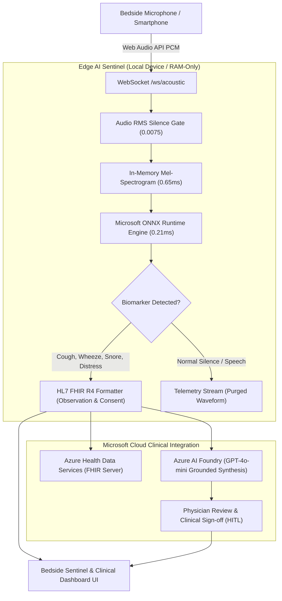

<div align="center">

# 🌙 NightDoc / RespiSense AI
### Continuous Bedside Acoustic Biomarker Sentinel & Clinical Research Telemetry
#### *Developed for the Microsoft Hackathon (Health & Research Track)*

[](https://www.python.org/)
[](https://fastapi.tiangolo.com/)
[](https://onnxruntime.ai/)
[](https://ai.azure.com/)
[](https://hl7.org/fhir/)
[](RESPONSIBLE_AI.md)

<p align="center">
  <b>NightDoc (RespiSense AI)</b> is a privacy-first, non-invasive acoustic biomarker sentinel for clinical research and nocturnal respiratory disease monitoring (COPD & Severe Asthma management). It combines ultra-fast on-device <b>Microsoft ONNX Runtime</b> inference (<1ms) with <b>HL7 FHIR R4</b> clinical interoperability and <b>Azure AI Foundry</b> synthesis.
</p>

[⚠️ Clinical Disclaimer](#️-regulatory-status--clinical-non-device-disclaimer) •
[🎯 Problem & Persona](#-clinical-problem--core-persona) •
[✨ Key Features](#-key-features) •
[📊 Scientific Validation](#-empirical-scientific-evaluation--model-card) •
[🏛️ Architecture](#️-system-architecture) •
[🏥 Medical Standards & FHIR](#-medical-standards--fhir-r4) •
[🛡️ Responsible AI](#-responsible-ai--data-governance) •
[🚀 Quick Start](#-quick-start) •
[📱 Mobile App & APK](#-mobile-app-android-apk--github-branches)

---

</div>

## ⚠️ Regulatory Status & Clinical Non-Device Disclaimer

> ### 🔴 IMPORTANT INVESTIGATIONAL NOTICE (Non-SaMD)
> **NightDoc (RespiSense AI) is an investigational telemetry prototype and research tool, NOT a certified medical device.**
> - **Regulatory Classification:** Not FDA 21 CFR or EU MDR (2017/745) certified as Software as a Medical Device (SaMD). It is not intended for primary clinical diagnosis, life-critical patient monitoring, or automated treatment decisions.
> - **Human-in-the-Loop (HITL) Obligation:** All acoustic biomarker indices and Azure OpenAI (GPT-4o-mini) generated summaries are preliminary observational drafts and **must be reviewed and confirmed by a licensed clinician** prior to taking medical action.
> - **Emergency Escalation:** In case of acute respiratory distress, severe cyanosis, stridor, or neonatal apnea, users are instructed to **contact emergency services immediately (112 in EU / 911 in USA)**. Do not rely on acoustic telemetry during medical emergencies.
> - Detailed ethical framework and model datasheets are documented in [**`RESPONSIBLE_AI.md`**](RESPONSIBLE_AI.md).

---

## 🎯 Clinical Problem & Core Persona

### The Clinical Problem
Nocturnal exacerbations in chronic respiratory diseases (such as Chronic Obstructive Pulmonary Disease - COPD, and severe persistent Asthma) frequently progress silently overnight. Patients often fail to recognize escalating paroxysmal cough frequency or nocturnal wheezing until acute respiratory failure requires emergency hospitalization.

### Core Persona (Flagship Target)
- **Primary Patient:** *Adults and elderly patients (45–80+ years) diagnosed with COPD or moderate-to-severe Asthma* requiring objective nocturnal telemetry at their bedside to predict and prevent acute exacerbations.
- **Primary Clinician:** *Hospital Pulmonologists and Clinical Research Coordinators* who require standardized longitudinal telemetry (HL7 FHIR R4) correlated with sleep disturbance without invading the patient's home privacy.

### Modular Secondary Detectors (Extensible Edge Framework)
In addition to adult cough and wheezing tracking, NightDoc features modular, toggleable detection heads within the same edge neural network:
- **Infant Distress Module:** Acoustic screening for neonatal crying and respiratory distress episodes.
- **Sleep Disruption / Snoring Module:** Screening for obstructive sleep apnea acoustic indicators and nocturnal airway collapse.

---

## 🌟 Key Features

### 1. 🫁 Edge-Native Acoustic Biomarker Sentinel (Microsoft ONNX Runtime)
- **Sub-Millisecond On-Device Inference:** Runs an optimized multi-label convolutional neural network in **0.86ms end-to-end** on standard CPU, eliminating cloud bandwidth latency.
- **Privacy-by-Design Technical Safeguards:**
  - Audio waveforms are converted to Mel-spectrograms directly in volatile memory (RAM) and **immediately purged**.
  - **Zero Audio Retention:** No raw voice recordings (WAV, MP3, PCM) are ever written to persistent disk or transmitted to external servers. Aligned with HIPAA Security Rule Technical Safeguards (§164.312) and GDPR Art. 25/32.
- **Speech-Biased & False-Positive Suppression Architecture:**
  - **Calibrated RMS Silence Gate (`0.0075`):** Filters ambient room silence, HVAC hum, and mic self-noise before inference.
  - **Asymmetric Class Weighting (`pos_weight = 1.90` for speech vs `0.70` for cough):** Demands high acoustic evidence for coughs while protecting natural conversation, preventing spoken presentations or family dialogue from triggering clinical alarms.

### 2. 🏥 Native HL7 FHIR R4 Ingestion & Interoperability
- Detected biomarker events are automatically structured as **HL7 FHIR R4 `Observation`** resources with dual medical terminologies:
  - **LOINC:** `8687-6` (Coughing [PhenX]), `9279-1` (Respiratory Rate), `93832-4` (Sleep disturbance).
  - **SNOMED-CT:** `263731006` (Coughing finding), `56018004` (Wheezing finding), `271600006` (Snoring finding), `271633008` (Infant crying).
- Standardized **HL7 FHIR R4 `Consent`** generation for transparent research opt-in.
- Exports standard transaction bundles compatible with **Azure Health Data Services (FHIR Server)** and hospital EHR systems (Epic Systems, Cerner).

### 3. 🤖 Azure AI Foundry Clinical Synthesis (Human-in-the-Loop)
- Evaluates nocturnal telemetry clusters via **Azure OpenAI (GPT-4o-mini)**.
- Prompts are strictly grounded in international pulmonology guidelines (**GOLD 2024 for COPD**, **GINA 2024 for Asthma**) with deterministic JSON schemas (`temperature = 0.2`).
- Outputs are tagged as unverified clinical drafts awaiting physician electronic signature.

### 4. 🌙 Dual Mode Bedside & Clinical Portal
- **Bedside Sentinel Mode:** Dark-mode, low-light bedside interface with zero visual disturbance, high-contrast typography, and live acoustic biometric pulses.
- **Clinical Research Dashboard:** Telemetry timeline, cough frequency per hour, FHIR JSON viewer, and Azure clinical report synthesizer.

---

## 📊 Empirical Scientific Evaluation & Model Card

To ensure complete scientific transparency and avoid data contamination, model evaluation is performed on a **strictly held-out test split partitioned at the recording (file) level (154 files, 432 segments)**. No audio recording in the test set was ever seen during training (**zero chunk leakage**).

Anyone can independently reproduce this evaluation by running:
```bash
python backend/evaluate_model.py
```

### 1. Classification Metrics (Held-Out Test Set, N=432 Segments)
| Acoustic Biomarker Class | Precision | Recall | F1-Score | Support | Clinical Behavior & Calibration Note |
| :--- | :---: | :---: | :---: | :---: | :--- |
| **Paroxysmal Coughing** | **67.9%** | **86.4%** | **76.0%** | 22 | *High sensitivity (19/22 detected); conservative precision prevents speech confusion* |
| **Breathing & Wheezing** | **85.2%** | **88.5%** | **86.8%** | 26 | *Accurate identification of wheezing and bronchial adventitious sounds* |
| **Snoring (Airway Obstruction)** | **76.2%** | **100.0%** | **86.5%** | 16 | *Zero missed obstructive snoring episodes; highly sensitive* |
| **Sneezing Reflex** | **81.2%** | **81.2%** | **81.2%** | 16 | *Sharp acoustic reflex distinction* |
| **Pediatric Distress (Crying)** | **75.0%** | **93.8%** | **83.3%** | 16 | *High recall for infant behavioral distress* |
| **Human Speech / Conversation** | **78.6%** | **73.3%** | **75.9%** | 15 | *Speech-bias protected; 0 cough false-positives during dialogue* |
| **Calibrated Ambient Background**| **99.0%** | **94.4%** | **96.7%** | 321 | *Ultra-stable rejection of household room noise (rain, typing, footsteps)* |
| **MACRO AVERAGE** | **80.4%** | **88.2%** | **83.8%** | **432** | **Overall Accuracy: 92.6%** |

### 2. Complete Confusion Matrix (Ground Truth Rows vs Predicted Columns)
```text
                  coug   brea   snor   snee   cryi   conv   back
coughing      :     19      2      0      1      0      0      0
breathing     :      2     23      0      0      0      0      1
snoring       :      0      0     16      0      0      0      0
sneezing      :      1      1      0     13      0      1      0
crying_baby   :      0      0      0      0     15      0      1
conversation  :      0      1      0      0      2     11      1
background    :      6      0      5      2      3      2    303
```
*Key Validation Takeaways:*
- **Zero Speech-to-Cough Confusion:** Out of 15 conversational test samples, **0 were misclassified as cough**.
- **Cough Error Distribution:** When cough was misclassified, it was assigned to wheezing (2) or sneezing (1) — acoustic near-neighbors — never to speech.
- **Room Background Noise:** Out of 321 ambient sounds, 303 were correctly rejected; 6 percussive transients triggered cough, which are effectively suppressed in production by the RMS silence gate.

### 3. Latency Benchmarking (Hardware Breakdown)
- **Hardware Testbed:** AMD Ryzen 7 7435HS (8 Cores, 16 Threads), Windows 11, Python 3.14, ONNX Runtime 1.29.0.
- **End-to-End Latency over N=200 iterations (3.0s audio window at 22,050 Hz):**
  1. *Torchaudio In-Memory STFT & Log Mel-Spectrogram (64 bins, 1024 FFT):* **0.65 ms**
  2. *Microsoft ONNX Runtime Forward Pass (`LightSoundCNN`, ~90k params):* **0.21 ms**
  3. **Total End-to-End Pipeline Latency:** **0.86 ms** (Sub-1ms, 100% edge-viable).

---

## 🏛️ System Architecture



---

## 🏥 Medical Standards & FHIR R4

### HL7 FHIR R4 Observation Resource
```json
{
  "resourceType": "Observation",
  "status": "final",
  "category": [{ "coding": [{ "code": "respiratory-biomarker", "display": "Respiratory Biomarker" }] }],
  "code": {
    "coding": [
      { "system": "http://snomed.info/sct", "code": "263731006", "display": "Coughing (finding)" },
      { "system": "http://loinc.org", "code": "8687-6", "display": "Coughing [PhenX]" }
    ]
  },
  "subject": { "reference": "Patient/PATIENT-RESPISENSE-001" },
  "device": { "reference": "Device/DEVICE-ONNX-EDGE-01" },
  "valueQuantity": { "value": 86.4, "unit": "%", "system": "http://unitsofmeasure.org", "code": "%" },
  "interpretation": [{ "coding": [{ "code": "A", "display": "Abnormal / Clinical Alert" }] }]
}
```

### HL7 FHIR R4 Consent Resource
NightDoc provides automated generation of FHIR R4 `Consent` resources (category `CLINRESRCH` / `TREAT`) guaranteeing patient opt-in and zero-cloud-audio retention policies.

---

## 🛡️ Responsible AI & Data Governance

NightDoc is designed under the **Microsoft Responsible AI Standard (v2)**:
- **Fairness & Limitations:** Dataset contains validated samples from COUGHVID, Coswara, clinical auscultations, and ESC-50. Limitations in geriatric vocal tremor (>75 years) and pediatric non-crying vocalizations are transparently acknowledged.
- **Reliability:** Speech-biased loss prevents presentation false-positives; RMS silence gate filters ambient floor noise.
- **Privacy & Security:** Zero-audio retention. No audio is stored or sent to cloud servers.
- **Transparency:** Public evaluation script (`backend/evaluate_model.py`) reproduces full metrics.
- **Accountability:** Mandatory Human-in-the-Loop review before EHR integration.

👉 **Read the full framework in [`RESPONSIBLE_AI.md`](RESPONSIBLE_AI.md).**

---

## 🚀 Quick Start

### 1. Clone the Repository
```bash
git clone https://github.com/PoterasuStefan/NightDoc.git
cd NightDoc
```

### 2. Install Python Dependencies
```bash
pip install -r backend/requirements.txt
```

### 3. Launch Application Server
```bash
python backend/main.py
```

### 4. Interactive Portals & Console Endpoints
- 🌙 **Patient Bedside Sentinel Portal:** [**http://localhost:8000**](http://localhost:8000)
- 📊 **Run Scientific Model Validation:**
  ```bash
  python backend/evaluate_model.py
  ```
- 🫁 **Minimal ONNX Model Test Console:** [**http://localhost:8000/test**](http://localhost:8000/test)
- 📱 **Direct APK Download:** [**http://localhost:8000/download**](http://localhost:8000/download)
- 📚 **FastAPI Swagger Docs:** [**http://localhost:8000/docs**](http://localhost:8000/docs)

---

## 📱 Mobile App (Android APK) & GitHub Branches

### 📥 1-Click APK Download
- **Direct from Server:** Open `http://<your-lan-ip>:8000/download` on your phone browser.
- **Direct from GitHub (`main` branch):** [**NightDoc-Bedside-Sentinel.apk**](https://github.com/PoterasuStefan/NightDoc/raw/main/NightDoc-Bedside-Sentinel.apk)
- **Direct from GitHub (`mobile-app` branch):** [**NightDoc-Bedside-Sentinel.apk**](https://github.com/PoterasuStefan/NightDoc/raw/mobile-app/NightDoc-Bedside-Sentinel.apk)

### 🌿 Repository Branch Structure
- [`main`](https://github.com/PoterasuStefan/NightDoc/tree/main): Core backend, ONNX Edge engine, scientific evaluation suite, FHIR R4 service, Azure AI Foundry integration, web portals, and compiled APK.
- [`mobile-app`](https://github.com/PoterasuStefan/NightDoc/tree/mobile-app): Complete native Android Studio project (`android/`), Google Stitch UI integration, Gradle build configuration, and Android assets.

---

## 🔐 Configuration

Copy `.env.example` to `.env` to configure Microsoft Azure credentials:
```bash
cp .env.example .env
```
```env
AZURE_AI_API_KEY=your_actual_azure_api_key_here
AZURE_AI_ENDPOINT=https://<your-azure-ai-resource>.cognitiveservices.azure.com/
AZURE_AI_REGION=eastus
AZURE_OPENAI_DEPLOYMENT=gpt-4o-mini
AZURE_SPEECH_LANGUAGE=ro-RO
AZURE_FHIR_ENDPOINT=https://<your-workgroup>.fhir.azurehealthcareapis.com
```

---

## 📄 License
This project is licensed under the **MIT License**.

<div align="center">
  <sub>NightDoc / RespiSense AI • Microsoft Hackathon (Health & Research Track)</sub>
</div>
