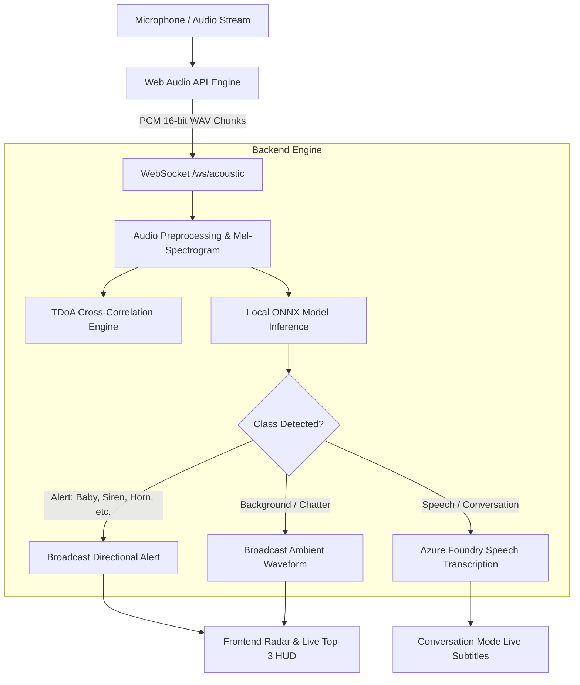

<div align="center">

# 🌐 SoundSight
### Real-Time 360° Acoustic Radar & Assistive Hearing AI

[](https://www.python.org/)
[](https://fastapi.tiangolo.com/)
[](https://onnxruntime.ai/)
[](https://ai.azure.com/)
[](LICENSE)

<p align="center">
  <b>SoundSight</b> transforms spatial acoustic awareness for the deaf and hard of hearing by combining an interactive 360° directional sound radar with edge ONNX audio classification and Microsoft Foundry cloud speech understanding.
</p>

[✨ Key Features](#-key-features) •
[🏛️ Architecture](#️-architecture) •
[🚀 Quick Start](#-quick-start) •
[📱 Mobile Setup](#-mobile-setup) •
[🔐 Configuration](#-configuration) •
[📦 Project Structure](#-project-structure)

---

</div>

## 🌟 Key Features

### 1. 🎯 360° Directional Acoustic Radar (Stand-by Mode)
- **High-Performance Canvas Visualizer**: 60 FPS HTML5 Canvas radiating radial spectrogram waves around a central circular interface.
- **TDoA (Time Difference of Arrival) Localization**: Cross-correlation sound localization calculating phase lag $\Delta t = \frac{d \cdot \sin(\theta)}{c}$ between microphone capsules.
- **Flat Chevron Directional Pointer**: Sleek non-overlapping indicator dynamically pointing toward sound bursts.
- **Ambient Chatter & Background Noise Filtering**: Suppresses false alarm popups during normal room chatter while rendering subtle ambient waveforms.

### 2. ⚡ Edge AI Sound Classifier (Local ONNX Model)
- Ultra-lightweight (**~360 KB**) local model running on CPU with zero cloud latency.
- Multi-label classification across **8 distinct acoustic classes**:
  - 👶 **Crying Baby** (Infant distress)
  - 🚑 **Emergency Siren** (Ambulance / Fire alarm)
  - 🚗 **Car Horn Blast** (Traffic warning)
  - 🐕 **Dog Bark** (Canine alert)
  - 🚪 **Door Knock** (Wood impact tap)
  - 👏 **Applause / Clapping** (Hand claps)
  - 💬 **Speech / Conversation** (Human dialogue)
  - 🍃 **Ambient Noise** (Background room noise)
- **Live Top-3 Confidence HUD**: Real-time sorted probability bars updating on every audio chunk.

### 3. 💬 Conversation Mode & Microsoft Foundry Subtitles
- **Instant Attention Trigger**: When human speech is detected, the *Conversation Mode* switcher lights up in vibrant Microsoft Emerald with a dynamic bounce animation.
- **Live Multilingual Captions**: Real-time speech transcription (Romanian `ro-RO` & English) with typing cursor and finalized conversation bubbles.
- **Microsoft Foundry & Azure AI Integration**: Powered by Azure AI Content Understanding and Azure Speech SDK.
- **Speaker Orientation Tracker**: Displays active compass bearing of the speaker (e.g., `Speaker at 60° (on your right)`).

---

## 🏛️ Architecture



---

## 🚀 Quick Start

### Prerequisites
- Python 3.10 or newer
- Microphone access (built-in, USB stereo, or smartphone)

### 1. Clone the Repository
```bash
git clone https://github.com/PoterasuStefan/SoundSight.git
cd SoundSight
```

### 2. Install Dependencies
```bash
pip install -r backend/requirements.txt
```

### 3. Launch the Server
```bash
python backend/main.py
```

### 4. Open in Browser
Open your browser and navigate to:
👉 **[http://localhost:8000](http://localhost:8000)**

---

## 📱 Mobile Setup

You can run SoundSight directly on your smartphone over local Wi-Fi:

1. Connect your phone to the **same Wi-Fi network** as your computer.
2. The server prints your local network IP upon startup:
   ```text
   [*] Local PC:    http://localhost:8000
   [*] Phone (LAN): http://192.168.1.xxx:8000
   ```
3. Open Chrome or Safari on your phone and go to `http://192.168.1.xxx:8000`.
4. **Install as PWA**: Tap Chrome's menu (`⋮`) $\rightarrow$ **Add to Home screen** (*Instalează aplicația*).
5. Tap **Mic Live** and test real-time directional sound alerts anywhere in the room!

> [!TIP]
> **Mobile Microphone Permission over LAN**: In Chrome on Android, if `http://` blocks the microphone, enable the flag: `chrome://flags/#unsafely-treat-insecure-origin-as-secure`, add your PC's IP address (`http://192.168.1.xxx:8000`), and relaunch.

---

## 🔐 Configuration

SoundSight is pre-configured with a secure environment template for Microsoft Foundry.

1. Copy `.env.example` to `.env`:
   ```bash
   cp .env.example .env
   ```
2. Open `.env` and add your Azure AI / Microsoft Foundry credentials:
   ```env
   # Microsoft Foundry & Azure AI Services
   AZURE_AI_API_KEY=your_actual_azure_api_key_here
   AZURE_AI_ENDPOINT=https://stefanpoterasu-2164-resource.cognitiveservices.azure.com/
   AZURE_AI_REGION=eastus
   AZURE_CONTENT_UNDERSTANDING_ANALYZER=conversation-analyzer
   AZURE_SPEECH_LANGUAGE=ro-RO
   ```

*(Note: `.env` is automatically ignored by `.gitignore` to keep your API keys 100% private).*

---

## 📦 Project Structure

```text
SoundSight/
├── backend/
│   ├── sound_radar_model.onnx   # Trained lightweight ONNX acoustic classifier (~360 KB)
│   ├── classifier.py            # ONNX inference, Mel-Spectrogram & TDoA Cross-Correlation
│   ├── azure_foundry.py         # Microsoft Foundry & Azure Speech SDK integration
│   ├── main.py                  # FastAPI WebSocket & REST application server
│   └── requirements.txt         # Python dependencies
├── js/
│   ├── radar.js                 # 360° Radial Canvas Visualizer & Chevron arrow engine
│   ├── audio.js                 # Web Audio API PCM capture & volume energy meter
│   ├── websocket.js             # Resilient WebSocket client with auto-reconnect
│   └── app.js                   # Application state, HUD controller, Speech Subtitles
├── index.html                   # Microsoft Fluent Dark single-page interface
├── styles.css                   # Acrylic Glassmorphism, animations & responsive styling
├── .env.example                 # Secure environment template for Microsoft Foundry
├── .gitignore                   # Ignores .env, Python caches, and raw training datasets
└── README.md                    # Project documentation
```

---

## 🧪 Testing with Simulator

SoundSight includes a built-in **Sound Event Simulator**:
1. Click **`⚡ Simulate`** in the top-right corner.
2. Select any acoustic event (e.g., *Crying Baby*, *Emergency Siren*, *Door Knock*, *Car Horn*, *Speech*).
3. Use the **360° manual angle slider** to test directional radar positioning across all quadrants.
4. Upload any `.wav` or `.mp3` file to test the ONNX classifier with real-world audio samples!

---

## 📄 License

This project is licensed under the **MIT License** - see the [LICENSE](LICENSE) file for details.

<div align="center">
  <sub>Developed with ❤️ for accessibility and real-time acoustic intelligence.</sub>
</div>
